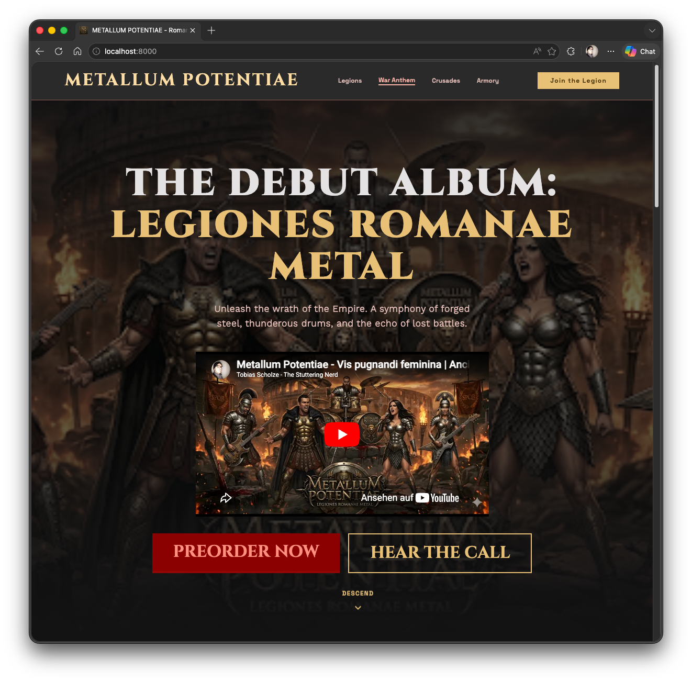

# Metallum Potentiae

> Epic one-page promo site for the fictional Roman metal project **METALLUM POTENTIAE**.

## Build status

| Project      | Action |
| ------------ | ------ |
| GitHub Pages | [](https://github.com/tscholze/web-metallum-potentiae/actions/workflows/static.yml)      |


## How it looks



## Tech Stack

- Plain HTML
- Tailwind CSS (CDN)
- Google Fonts
- Minimal vanilla JavaScript interactions

## Run Locally

Open either HTML file directly in your browser:

- `index_de.html` (German)
- `index.html` (English)

Or use any static file server, for example:

```bash
python3 -m http.server 8000
```

Then visit `http://localhost:8000`.

## Notes

- The page references external assets (fonts and images), so an internet connection is required for full rendering.
- This repository currently has no build step or package dependencies.

### Never intended for production

This experiment was built purely for educational purposes. I am not a musician, graphic designer, or web developer. Learning is fun!

## Authors

Just me, [Tobi](https://tscholze.github.io). It is not planned to update this experiment regularly.

## Thanks to

- [Phil](https://www.linkedin.com/in/philipp-skorpil-562363233/) for showing me some crazy AI tricks!

## License

This project is licensed under the MIT License. See [LICENSE.md](LICENSE.md) for details.
Dependencies or assets may be licensed differently.
